<div align="center">


<br/>

<a href="https://github.com/SemyonSinchenko/safetensors-spark/actions/workflows/ci.yml">
  
</a>
<a href="https://opensource.org/licenses/Apache-2.0">
  
</a>

</div>

---

## Overview

### How Spark Rows Map to Safetensors Files

The connector supports two write modes. In **Batch mode** every `batch_size` rows
are stacked into a single safetensors file, one tensor per column. In **KV mode**
each row is written as individually named tensors keyed by a string column, with
files rolling over at a configurable size threshold.


### Generated Directory Structure

```mermaid
graph TD
    ROOT["/output/path/"]

    ROOT --> S0["part-00000-0000-&lt;uuid&gt;.safetensors"]
    ROOT --> S1["part-00000-0001-&lt;uuid&gt;.safetensors"]
    ROOT --> S2["part-00001-0000-&lt;uuid&gt;.safetensors"]
    ROOT --> SN["part-NNNNN-MMMM-&lt;uuid&gt;.safetensors"]
    ROOT --> MF["dataset_manifest.json"]
    ROOT --> IX["_tensor_index.parquet\n(only when generate_index=true)"]

    S0 --> S0H["Header (JSON)\n• tensor offsets\n• dtype, shape per key"]
    S0 --> S0B["Byte buffer\n• raw little-endian tensor data"]

    MF --> MFC["{\n  format_version,\n  total_samples,\n  total_bytes,\n  shards: […],\n  schema: {…}\n}"]

    IX --> IXC["Columns:\n  tensor_key | file_name | shape | dtype"]
```



---

## Motivation

Preparing training data for distributed PyTorch workloads typically starts in Apache
Spark, but the handoff between Spark and PyTorch is painful. The common approaches
all have meaningful drawbacks:

- **Parquet** requires decompression and columnar-to-row conversion at load time;
  PyTorch `DataLoader` workers spend measurable CPU time on this before the GPU
  sees any data.
- **Arrow/IPC files** are faster but still carry a schema negotiation layer and are
  not natively understood by the HuggingFace `safetensors` ecosystem.
- **Custom binary formats** (raw `.bin`, `.npy` shards) require bespoke readers on
  both the Spark side and the PyTorch side, with no shared contract.

[Safetensors](https://github.com/huggingface/safetensors) is a simple, open format
designed for exactly this boundary: zero-copy mmap loading, no decompression, and
direct dtype-aware tensor materialisation. This project brings a native Apache Spark
DataSource V2 connector for safetensors, so the full Spark → PyTorch pipeline
becomes a single `.write.format("safetensors")` call.

### Trade-offs vs Parquet / Arrow

|                        | Safetensors                               | Parquet                          | Arrow/IPC        |
| ---------------------- | ----------------------------------------- | -------------------------------- | ---------------- |
| PyTorch load speed     | ✅ Fast (mmap, zero-copy)                 | ⚠️ Slower (decompress + convert) | ⚠️ Moderate      |
| Compression            | ❌ None                                   | ✅ Snappy/Zstd/etc.              | ✅ Optional      |
| Storage size           | ❌ Larger on disk                         | ✅ Compact                       | ⚠️ Moderate      |
| Native PyTorch support | ✅ First-class                            | ❌ Needs adapter                 | ❌ Needs adapter |
| Format complexity      | ✅ Trivial (8-byte header + JSON + bytes) | ⚠️ Complex                       | ⚠️ Moderate      |
| Random key access      | ✅ O(1) by tensor key                     | ❌ Row-group scan                | ⚠️ Moderate      |

The lack of compression is the main cost. For large float tensors the on-disk
footprint will be noticeably larger than Parquet with Zstd. If storage cost
dominates over training throughput, Parquet remains the right choice.

### Two write modes

**Batch mode** (`batch_size` option) stacks every N input rows into one tensor
along the leading dimension and writes one standalone safetensors file per batch.
This is the natural fit for **offline batch training**: the PyTorch `DataLoader`
can simply glob the output directory and iterate over files, with no manifest
parsing required.

**KV mode** (`name_col` option) writes each input row as one or more individually
named tensors, keyed by a string column. Files roll over when they reach a
configurable size threshold. This targets a **cold/warm feature store** pattern:
embeddings or precomputed features are written once from Spark and later retrieved
by key from PyTorch inference code. Random access is fast because safetensors
stores byte offsets per key in the file header, so a single seek suffices. This
is not suitable for hot, low-latency serving (a dedicated vector store is better
there), but works well for nightly-refreshed feature tables consumed during
training or batch inference.

---

## Compatibility

| Component    | Version      |
| ------------ | ------------ |
| Apache Spark | 4.0.x, 4.1.x |
| Java         | 17+          |
| Scala        | 2.13         |

---

## Installation

> TBD

---

## Quick Start

### Reading safetensors files

```python
df = (
    spark.read
    .format("safetensors")
    .option("inferSchema", "true")
    .load("/data/tensors/")
)
df.printSchema()
# root
#  |-- image: struct (nullable = false)
#  |    |-- data:  binary    (nullable = false)
#  |    |-- shape: array<int>(nullable = false)
#  |    |-- dtype: string    (nullable = false)
#  |-- label: struct (nullable = false)
#  |    |-- ...
```

### Writing safetensors files

**Batch mode** (each N rows → one file with stacked tensors):

```python
(
    df.write
    .format("safetensors")
    .option("batch_size", "1000")
    .option("dtype", "F32")
    .mode("overwrite")
    .save("/output/tensors/")
)
```

**KV mode** (each row → one tensor per non-key column):

```python
(
    df.write
    .format("safetensors")
    .option("name_col", "user_id")
    .option("generate_index", "true")
    .mode("overwrite")
    .save("/output/embeddings/")
)
```

---

## Roadmap

### ✅ Implemented Features

**Read Path**

- DataSource V2 TableProvider with short name "safetensors"
- Schema inference from first file header or `_tensor_index.parquet`
- Explicit schema via `.schema(...)`
- Column pruning (skips tensor byte buffers when `data` field not in projection)
- All 12 dtypes: F16, F32, F64, BF16, U8, I8, U16, I16, U32, I32, U64, I64
- Local mmap read + remote filesystem read (HDFS, S3, GCS)

**Write Path**

- Batch mode (`batch_size`) with tail strategies: drop, pad, write
- KV mode (`name_col`) with multi-column support
- Custom `kv_separator` for compound tensor keys
- Duplicate key handling (`fail` or `lastWin`)
- `dataset_manifest.json` generation
- `_tensor_index.parquet` generation when `generate_index=true`
- Overwrite mode support (`mode("overwrite")`)

**Catalyst Expressions**

- `arr_to_st(arrayCol, shape, dtype)` — converts Array to Tensor Struct
- `st_to_array(tensorCol)` — decodes Tensor Struct to Array[Floats]

**MLflow Integration**

- Python `log_dataset()` function (pure Python, no Spark dependency)
- JVM `SafetensorsDatasetSource` utility

**Testing**

- Unit tests for all core components
- Bidirectional Python↔Spark integration tests

### 📋 Not Implemented

- **Predicate pushdown** (dtype/shape filtering at file level) — predicates are
  currently returned as post-scan filters.

---

## Documentation

| Document                             | Purpose                                                        |
| ------------------------------------ | -------------------------------------------------------------- |
| `README.md`                          | User-facing API and examples                                   |
| `format/SPECIFICATION.md`            | Binary format, JSON schemas, output layout                     |
| `format/ataset_manifest.schema.json` | Manifest JSON schema                                           |
| `AGENTS.md`                          | Build commands, code style, invariants (for developers/agents) |

---

## Limitations & Known Caveats

| Limitation                      | Detail                                                      |
| ------------------------------- | ----------------------------------------------------------- |
| BF16/F16 write approximation    | `arr_to_st()` uses truncation, not round-to-nearest-even.   |
| Schema inference reads one file | All files assumed to share the first file's schema.         |
| No mid-file splits              | One `.safetensors` file = one Spark task.                   |
| Off-heap mapping on JVM < 21    | `MappedByteBuffer` cannot be explicitly unmapped before GC. |
| `_metadata.parquet` reserved    | Global index uses `_tensor_index.parquet` instead.          |
