<div align="center">


<br/>

<a href="https://github.com/SemyonSinchenko/safetensors-spark/actions/workflows/ci.yml">
  
</a>
<a href="https://opensource.org/licenses/Apache-2.0">
  
</a>

</div>

---

## Table of Contents

- [Overview](#overview)
  - [The Big Picture](#the-big-picture)
  - [How Spark Rows Map to Safetensors Files](#how-spark-rows-map-to-safetensors-files)
  - [Generated Directory Structure](#generated-directory-structure)
- [Motivation](#motivation)
  - [Trade-offs vs Parquet / Arrow](#trade-offs-vs-parquet--arrow)
  - [Two write modes](#two-write-modes)
- [Installation](#installation)
- [Quick Start](#quick-start)
  - [Minimal example](#minimal-example)
  - [Writing safetensors files](#writing-safetensors-files)
- [Write Options](#write-options)
  - [Mode selection](#mode-selection)
  - [Common options](#common-options)
  - [Batch mode options](#batch-mode-options)
  - [KV mode options](#kv-mode-options)
- [Compatibility](#compatibility)
- [Roadmap](#roadmap)
- [Documentation](#documentation)
- [Limitations & Known Caveats](#limitations--known-caveats)

---

## Overview

### The Big Picture

`safetensors-spark` is a bridge between two worlds that rarely speak the same
language natively:

- **The Data Engineering world** — large-scale PySpark ETL pipelines running on
  distributed clusters, processing terabytes of raw data (text, images, tabular
  features, embeddings) into clean, structured datasets.
- **The Deep Learning world** — distributed PyTorch training jobs that need to
  consume those datasets as fast as possible, with minimal CPU overhead, so that
  GPUs stay saturated.

```mermaid
flowchart LR
    subgraph DE["🏭 Data Engineering"]
        RAW["Raw Data\n(S3 / HDFS / GCS)"]
        ETL["PySpark ETL\n(cleaning, tokenising,\nfeature extraction)"]
        RAW --> ETL
    end

    subgraph Bridge["🌉 safetensors-spark"]
        direction TB
        WRITE["spark.write\n.format('safetensors')"]
        FILES[".safetensors shards\n+ dataset_manifest.json"]
        WRITE --> FILES
    end

    subgraph DL["🧠 Deep Learning"]
        LOADER["PyTorch DataLoader\n(mmap, zero-copy)"]
        TRAIN["Distributed Training\n(DDP / FSDP)"]
        LOADER --> TRAIN
    end

    ETL -->|"primary use-case\n✅ complete & well-tested"| WRITE
    FILES --> LOADER

    READ["spark.read\n.format('safetensors')"]
    FILES -.->|"secondary use-case\n⚠️ basic support"| READ
```



> **Primary direction: Spark → safetensors.**
> Writing safetensors files from Spark is the main purpose of this project and is
> complete, well-tested, and production-ready. Reading safetensors files back into
> Spark is supported for convenience (e.g. validation, inspection, or feature
> pipelines that consume pre-built tensors), but is a secondary use-case with more
> limited functionality and less extensive test coverage.

### How Spark Rows Map to Safetensors Files

The connector supports two write modes. In **Batch mode** every `batch_size` rows
are stacked into a single safetensors file, one tensor per column. In **KV mode**
each row is written as individually named tensors keyed by a string column, with
files rolling over at a configurable size threshold.

```mermaid
flowchart TD
    subgraph Spark["Apache Spark"]
        DF["DataFrame\n(rows × columns)"]
        P0["Partition 0"]
        P1["Partition 1"]
        PN["Partition N"]
        DF --> P0 & P1 & PN
    end

    subgraph BatchMode["Batch Mode  (batch_size = B)"]
        direction TB
        P0 -->|"rows 0..B-1"| F0["part-00000-0000-&lt;uuid&gt;.safetensors\ntensors: col_a[B,…], col_b[B,…]"]
        P0 -->|"rows B..2B-1"| F1["part-00000-0001-&lt;uuid&gt;.safetensors\ntensors: col_a[B,…], col_b[B,…]"]
        P1 -->|"rows 0..B-1"| F2["part-00001-0000-&lt;uuid&gt;.safetensors\ntensors: col_a[B,…], col_b[B,…]"]
    end

    subgraph KVMode["KV Mode  (name_col = 'id')"]
        direction TB
        P0 -->|"row: id=alice, emb=[…]"| K0["part-00000-0000-&lt;uuid&gt;.safetensors\nkey: alice::emb → tensor[…]"]
        P0 -->|"row: id=bob,   emb=[…]"| K0
        P1 -->|"row: id=carol, emb=[…]"| K1["part-00001-0000-&lt;uuid&gt;.safetensors\nkey: carol::emb → tensor[…]"]
    end
```



### Generated Directory Structure


---

## Motivation

Preparing training data for distributed PyTorch workloads typically starts in Apache
Spark, but the handoff between Spark and PyTorch is painful. The common approaches
all have meaningful drawbacks:

- **Parquet** requires decompression and columnar-to-row conversion at load time;
  PyTorch `DataLoader` workers spend measurable CPU time on this before the GPU
  sees any data.
- **Arrow/IPC files** are faster but still carry a schema negotiation layer and are
  not natively understood by the HuggingFace `safetensors` ecosystem.
- **Custom binary formats** (raw `.bin`, `.npy` shards) require bespoke readers on
  both the Spark side and the PyTorch side, with no shared contract.

[Safetensors](https://github.com/huggingface/safetensors) is a simple, open format
designed for exactly this boundary: zero-copy mmap loading, no decompression, and
direct dtype-aware tensor materialisation. This project brings a native Apache Spark
DataSource V2 connector for safetensors, so the full Spark → PyTorch pipeline
becomes a single `.write.format("safetensors")` call.

### Trade-offs vs Parquet / Arrow

|                        | Safetensors                               | Parquet                          | Arrow/IPC        |
| ---------------------- | ----------------------------------------- | -------------------------------- | ---------------- |
| PyTorch load speed     | ✅ Fast (mmap, zero-copy)                 | ⚠️ Slower (decompress + convert) | ⚠️ Moderate      |
| Compression            | ❌ None                                   | ✅ Snappy/Zstd/etc.              | ✅ Optional      |
| Storage size           | ❌ Larger on disk                         | ✅ Compact                       | ⚠️ Moderate      |
| Native PyTorch support | ✅ First-class                            | ❌ Needs adapter                 | ❌ Needs adapter |
| Format complexity      | ✅ Trivial (8-byte header + JSON + bytes) | ⚠️ Complex                       | ⚠️ Moderate      |
| Random key access      | ✅ O(1) by tensor key                     | ❌ Row-group scan                | ⚠️ Moderate      |

The lack of compression is the main cost. For large float tensors the on-disk
footprint will be noticeably larger than Parquet with Zstd. If storage cost
dominates over training throughput, Parquet remains the right choice.

### Two write modes

**Batch mode** (`batch_size` option) stacks every N input rows into one tensor
along the leading dimension and writes one standalone safetensors file per batch.
This is the natural fit for **offline batch training**: the PyTorch `DataLoader`
can simply glob the output directory and iterate over files, with no manifest
parsing required.

**KV mode** (`name_col` option) writes each input row as one or more individually
named tensors, keyed by a string column. Files roll over when they reach a
configurable size threshold. This targets a **cold/warm feature store** pattern:
embeddings or precomputed features are written once from Spark and later retrieved
by key from PyTorch inference code. Random access is fast because safetensors
stores byte offsets per key in the file header, so a single seek suffices. This
is not suitable for hot, low-latency serving (a dedicated vector store is better
there), but works well for nightly-refreshed feature tables consumed during
training or batch inference.

---

## Installation

The connector is published to Maven Central. The artifact name is parameterised by
the **minor** Spark version you are targeting:

```
io.github.semyonsinchenko:safetensors-spark-<sparkMinorVersion>_2.13:<version>
```

For example, for **Spark 4.0** and connector version **0.0.1**:

```
io.github.semyonsinchenko:safetensors-spark-4.0_2.13:0.0.1
```

### Adding the JAR

The JAR **must** be on the Spark classpath. The recommended way for interactive or
script use is the `--packages` flag, which resolves the artifact from Maven Central
automatically:

```bash
pyspark --packages io.github.semyonsinchenko:safetensors-spark-4.0_2.13:0.0.1
```

For cluster deployments (e.g. `spark-submit`) use the same flag:

```bash
spark-submit \
  --packages io.github.semyonsinchenko:safetensors-spark-4.0_2.13:0.0.1 \
  your_script.py
```

### Registering the Spark extension

The connector exposes two Catalyst expressions (`arr_to_st` and `st_to_array`) that
must be registered via the Spark extensions mechanism. Add the following config
**before** the `SparkSession` is created:

```python
spark = (
    SparkSession.builder
    .config(
        "spark.sql.extensions",
        "io.github.semyonsinchenko.safetensors.SafetensorsExtensions",
    )
    .getOrCreate()
)
```

Or equivalently in `spark-defaults.conf` / cluster config:

```
spark.sql.extensions=io.github.semyonsinchenko.safetensors.SafetensorsExtensions
```

> **Note:** The extension registration is required only if you use the
> `arr_to_st()` or `st_to_array()` SQL/DataFrame functions. Plain
> `.write.format("safetensors")` and `.read.format("safetensors")` work without it.

---

## Quick Start

### Minimal example

Write from PySpark:

``` python
import random
rng = random.Random(42)

rows = [
    [rng.random() for _ in range(100)]
    for _n in range(30)
]

df = spark.createDataFrame(rows, schema="array<double>")

(
	df
	.write
	.format("safetensors")
	.mode("overwrite")
	.option("dtype", "F32")
	.option("batch_size", "15")
	.save("test-data")
)
```

Read from safetensors:

``` python
with open("test-data/dataset_manifest.json", "r") as f_:
    manifest = json.load(f_)

first_file = manifest["shards"][0]["shard_path"]
data = safe_open(f"test-data/{first_file}", "numpy")

data.get_tensor("value")
```

### Writing safetensors files

**Batch mode** (each N rows → one file with stacked tensors):

```python
(
    df.write
    .format("safetensors")
    .option("batch_size", "1000")
    .option("dtype", "F32")
    .mode("overwrite")
    .save("/output/tensors/")
)
```

**KV mode** (each row → one tensor per non-key column):

```python
(
    df.write
    .format("safetensors")
    .option("name_col", "user_id")
    .option("generate_index", "true")
    .mode("overwrite")
    .save("/output/embeddings/")
)
```

---

## Write Options

All options are passed via `.option(key, value)` on the DataFrameWriter.
Option names are **case-insensitive**.

### Mode selection

Exactly one of the following two options **must** be specified. They are mutually
exclusive.

| Option | Type | Description |
| --- | --- | --- |
| `batch_size` | `Int` (> 0) | **Batch mode.** Number of rows to stack into each output file. Every `batch_size` rows are concatenated along the leading tensor dimension and written as a single `.safetensors` file. |
| `name_col` | `String` | **KV mode.** Name of the DataFrame column whose value is used as the tensor key prefix. All other (non-key) columns are written as individually named tensors per row. Files roll over at `target_shard_size_mb`. |

### Common options

These options are supported in **both** Batch mode and KV mode.

| Option | Type | Default | Description |
| --- | --- | --- | --- |
| `dtype` | `String` | _(none)_ | Target dtype for all output tensors. Must be one of: `F16`, `F32`, `F64`, `BF16`, `U8`, `I8`, `U16`, `I16`, `U32`, `I32`, `U64`, `I64`. Required when the input columns are numeric arrays (`Array<T>`); optional when columns are already Tensor Structs (dtype is taken from the struct). |
| `columns` | `String` | _(none — all columns)_ | Comma-separated list of column names to serialize as tensors. Columns not listed are ignored. When using KV mode the `name_col` column is always excluded from tensor output regardless of this setting. Example: `"image, label, weight"`. |
| `shapes` | `String` (JSON) | `{}` | Per-column shape overrides as a JSON object mapping column name to a list of integers. The leading batch dimension is **not** included — it is inferred from `batch_size` or the number of rows in the shard. Example: `{"image": [3, 224, 224], "label": [1]}`. |
| `duplicatesStrategy` | `String` | `fail` | How to handle duplicate tensor keys within a single output file. `fail` — throw an exception on the first duplicate (default). `lastWin` — silently overwrite with the last-seen value. |
| `generate_index` | `Boolean` | `false` | When `true`, writes a `_tensor_index.parquet` file at the output root containing one row per tensor key with columns `tensor_key`, `file_name`, `shape`, and `dtype`. Useful for downstream random-access lookups. |
| `kv_separator` | `String` | `__` | Separator string inserted between the `name_col` value and the column name when constructing tensor keys in KV mode. For example, with `name_col=user_id`, `kv_separator=/`, and a column named `emb`, the tensor key becomes `alice/emb`. Also accepted in Batch mode (has no effect there). |

### Batch mode options

These options are only meaningful when `batch_size` is set.

| Option | Type | Default | Valid values | Description |
| --- | --- | --- | --- | --- |
| `tail_strategy` | `String` | `write` | `write`, `drop`, `pad` | Controls what happens to the final batch when the number of remaining rows is less than `batch_size`. `write` — write the partial batch as-is (leading dimension will be smaller than `batch_size`). `drop` — discard the partial batch entirely. `pad` — pad the partial batch with zeros up to `batch_size`. |

### KV mode options

These options are only meaningful when `name_col` is set.

| Option | Type | Default | Valid values | Description |
| --- | --- | --- | --- | --- |
| `target_shard_size_mb` | `Int` | `300` | `50` – `1000` | Approximate target size in megabytes for each output shard file. A new shard is started when the accumulated tensor bytes for the current shard exceed this threshold. Must be between 50 and 1000 (inclusive). |

---

## Compatibility

| Component    | Version      |
| ------------ | ------------ |
| Apache Spark | 4.0.x, 4.1.x |
| Java         | 17+          |
| Scala        | 2.13         |

---

## Roadmap

### ✅ Implemented Features

**Read Path**

- DataSource V2 TableProvider with short name "safetensors"
- Schema inference from first file header or `_tensor_index.parquet`
- Explicit schema via `.schema(...)`
- Column pruning (skips tensor byte buffers when `data` field not in projection)
- All 12 dtypes: F16, F32, F64, BF16, U8, I8, U16, I16, U32, I32, U64, I64
- Local mmap read + remote filesystem read (HDFS, S3, GCS)

**Write Path**

- Batch mode (`batch_size`) with tail strategies: drop, pad, write
- KV mode (`name_col`) with multi-column support
- Custom `kv_separator` for compound tensor keys
- Duplicate key handling (`fail` or `lastWin`)
- `dataset_manifest.json` generation
- `_tensor_index.parquet` generation when `generate_index=true`
- Overwrite mode support (`mode("overwrite")`)

**Catalyst Expressions**

- `arr_to_st(arrayCol, shape, dtype)` — converts Array to Tensor Struct
- `st_to_array(tensorCol)` — decodes Tensor Struct to Array[Floats]

**MLflow Integration**

- Python `log_dataset()` function (pure Python, no Spark dependency)
- JVM `SafetensorsDatasetSource` utility

**Testing**

- Unit tests for all core components
- Bidirectional Python↔Spark integration tests

### 📋 Not Implemented

- **Predicate pushdown** (dtype/shape filtering at file level) — predicates are
  currently returned as post-scan filters.

---

## Documentation

| Document                             | Purpose                                                        |
| ------------------------------------ | -------------------------------------------------------------- |
| `README.md`                          | User-facing API and examples                                   |
| `format/SPECIFICATION.md`            | Binary format, JSON schemas, output layout                     |
| `format/ataset_manifest.schema.json` | Manifest JSON schema                                           |
| `AGENTS.md`                          | Build commands, code style, invariants (for developers/agents) |

---

## Limitations & Known Caveats

| Limitation                      | Detail                                                      |
| ------------------------------- | ----------------------------------------------------------- |
| BF16/F16 write approximation    | `arr_to_st()` uses truncation, not round-to-nearest-even.   |
| Schema inference reads one file | All files assumed to share the first file's schema.         |
| No mid-file splits              | One `.safetensors` file = one Spark task.                   |
| Off-heap mapping on JVM < 21    | `MappedByteBuffer` cannot be explicitly unmapped before GC. |
| `_metadata.parquet` reserved    | Global index uses `_tensor_index.parquet` instead.          |
